# QC workflow — one picture

Rendered by GitHub and most Markdown viewers (Mermaid). Boxes are modules or notebook sections; edges carry the tables named in the contracts below. Dashed edges are inputs that are not data (configuration, reviews, organiser answers). Numbers in brackets refer to `docs/qc_plan.md` sections.

The parallel morphology measurement workflow is documented in
`analysis/morphology/benchmark/README.md` (E24). Its live status source is
`analysis/morphology/metric_register.json`, rendered into `docs/morphology_metrics.md`
and `analysis/morphology/output/metric_atlas.html`. Read-only BSE inputs and cached
site thresholds produce candidate masks, width/hysteresis/connectivity tables and
an independent annotation pack. Explicit human annotations feed a separate error
evaluation; unreviewed predictions never serve as reference labels. This workflow
does not feed new descriptors into the frozen primary decision family.

```mermaid
flowchart TD
  %% ---------------- inputs
  subgraph IN["Inputs"]
    D[("Dataset/Batch_*/img_&lt;site&gt;_{BSE,ETD|SE,Inlens}.tif<br/>31 sites · 3 channels · 25 nm/px nominal")]
    U[("Unseen batch folder<br/>(arrives mid-event) [2.10]")]
    CFG["Configuration cell [2.1]<br/>reference = Batch_3 · compare list · α, power<br/>5 primary KPIs · consequence weights · Thresholds (hashed)<br/><i>developed on Batches 1–3, frozen before the unseen batch</i>"]
    REG["Assumption register A1–A15<br/>+ organiser answers"]
  end

  %% ---------------- features
  subgraph FE["polaron_qc.features  [2.2]   extract_batch(folder) → 4 tables"]
    F0["Load channel 0 · SE→ETD alias"]
    F5["Per-image quality (untrimmed)<br/>mean, p1, p50, p99, std, gray_levels, empty_bin_frac, band_top/bottom<br/><i>derived flags (stretch > 0.2, BSE p1 > 10) are applied downstream</i>"]
    F1["Trim bright edge bands"]
    F2["BSE segmentation (site thresholds)<br/>graphite-mode valley · pore / graphite / bright<br/>bright_sep · bright_low_contrast · pore_mode_resolved"]
    F3["Site KPIs (BSE)<br/>pore, crack-like voids (> 500 px), bright phase, profiles, texture<br/>+ particle table"]
    F4["ETD / Inlens inside BSE masks<br/>intra-particle cracks @ RIDGE_T = 0.4, curtaining, boundary sharpness,<br/>Inlens texture (confounded)"]
    F6["512-px patches (trimmed-frame y0, x0!)<br/>pore_frac, bright_frac, bright_count, crack_area_frac,<br/>pore_max_d (whole component), corr_len_px, graphite_mode_local, flags"]
    F0 --> F5
    F0 --> F1 --> F2 --> F3
    F2 --> F4
    F2 --> F6
    F3 --> F6
  end
  D --> F0
  U --> F0

  FCACHE[("analysis_cache/features/<br/>&lt;batch&gt;_&lt;hash&gt;.{sites,images,particles,patches}.parquet<br/>hash = files + mtimes + FEATURE_VERSION + patch geometry")]
  F3 --> FCACHE
  F4 --> FCACHE
  F5 --> FCACHE
  F6 --> FCACHE

  %% ---------------- reference
  subgraph REF["Reference characterisation  [2.3]  (polaron_qc.stats)"]
    R1["Per-KPI reference spread<br/>with / without known-anomalous sites<br/>(grey-pore, cracked)"]
    R2["Minimum detectable change<br/>α, 80 % power, usable n by simulation"]
    R3["Reference-split diagnostics (driver calls CMP + DEC on 7-v-10 splits)<br/>drift alerts · local flags · quality abstentions<br/>(internal, with uncertainty; does not validate 7 v 17)"]
  end
  GATE["Usable-n gate (per KPI × batch)<br/>bright_* KPIs drop low-contrast sites · pore_*/crack_* keep grey-pore as 'fallback'<br/>→ n_ref_usable, n_batch_usable, allocation counts"]
  FCACHE --> GATE
  F5 -.-> GATE
  GATE --> R1 --> R2
  GATE -.->|"n_incoming per KPI"| R2

  %% ---------------- comparison
  subgraph CMP["Pairwise comparison  [2.4]  (polaron_qc.stats)"]
    C1["Per-KPI: robust shift (median diff / ref MAD) · bootstrap CI (approx.)<br/>site-level permutation p — statistic = <b>hl_shift</b> (Hodges–Lehmann; median_diff is too discrete at 7 v 17)<br/>Holm on primary 5"]
    C2["Multivariate: energy distance on primary KPIs<br/>consequence-weighted · permutation p<br/>scaling re-fitted inside every permutation"]
    C3["Per-site drift score<br/>batch-wide vs few sites"]
    C4["Local-anomaly check<br/>per-site maxima & extreme patches vs ordinary-reference max<br/>→ <b>evidence flag</b> (≈ 41 % chance on a clean 7-site batch)"]
  end
  GATE --> C1
  GATE --> C2
  GATE --> C3
  GATE --> C4
  F6 -.->|"patch extremes aggregated to per-site maxima by caller"| C4
  CFG -.-> C1
  CFG -.-> C2

  %% ---------------- ML
  subgraph ML["ML corroboration  [2.5]  (polaron_qc.ml)"]
    M1["Grouped-CV L1 logistic regression<br/>site = group · equal site weight · scaler refit per fold<br/>site-level Monte Carlo null → AUC band, p, selected KPIs, per-site OOF prob<br/><b>material-only run drives A(iv); flag-inclusive run shown separately</b>"]
    M2["Patch-embedding novelty (exploratory)<br/>DINOv2 ViT-S/14 @ 518 px on per-image-normalised BSE patches<br/>PCA(32) on reference, refit per LOO fold · kNN(5)<br/>novelty tracks acquisition (bse_std, curtaining, black level)"]
  end
  FCACHE --> M1
  D --> M2
  U --> M2
  MLCACHE[("analysis_cache/ml/<br/>embeddings (hash-keyed, portable) · c2st results · novelty tables · correlates")]
  M2 --> MLCACHE
  M1 --> MLCACHE

  %% ---------------- acquisition & physics
  subgraph ACQ["Sensitivity to acquisition adjustment  [2.6]  (polaron_qc.acquisition)"]
    A0["derive_flags: contrast stretch · black level · low contrast · bands<br/>acquisition_group (data rules; cracked_known is reference-only)"]
    A1["Unadjusted<br/>(compare + energy)"] --- A2["Stratified to ordinary groups<br/>n_ref_kept / n_batch_kept · refuses &lt; 4 per side"] --- A3["Adjusted: residualised on 3 continuous covariates<br/>(bright_sep, bse_p1, boundary sharpness), OLS <b>re-fitted per permutation</b><br/>+ 7-covariate ridge variant shown beside it"]
    A4["three_channel_agreement<br/>robust z of per-channel intensity & texture · pattern label"]
    A5["threshold_bands: pore_frac / bright_frac under th ± 5 levels, every site"]
  end
  F5 --> A0
  F2 -.-> A0
  GATE --> A1
  GATE --> A2
  GATE --> A3
  A0 --> A2
  A0 --> A3
  F5 --> A4
  F3 --> A4
  F4 --> A4
  F2 --> A5
  ACACHE[("analysis_cache/acquisition_sites.csv<br/>flags ⋈ threshold bands")]
  A0 --> ACACHE
  A5 --> ACACHE
  A5 -.->|"reliability condition"| DB
  A5 -.->|"gate on physics wording"| E1

  subgraph PHY["Physics reading  [2.6b]  (polaron_qc.physics) — qualitative, relative"]
    P1["Stereology (secondary)<br/>Delesse · Saltykov (additive only) · nominal mass fraction<br/>(biased by unsegmented binder → not on first screen)"]
    P2["Void geometry (re-opens masks)<br/>delamination index · columns interrupted · longest void / thickness<br/>(geometry, not continuity)"]
    P3["Section connectivity: fraction_connected = 0 on all 31 sites<br/>(one dataset-level fact; tortuosity index undefined)<br/>additive size reading (matched quantiles) · mechanics direction"]
    P4a["Consequence weights (ordinal 1–3)<br/>+ rationale + KPI labels"]
    P4b["Measurement sanity checks<br/>fractions sum · porosity-vs-typical (dataset-level, with alternatives)<br/>(threshold band now owned by ACQ/A5)"]
  end
  FCACHE --> P1
  F2 --> P2
  F2 --> P3
  F2 --> P4b
  PCACHE[("analysis_cache/physics_sites.csv")]
  P2 --> PCACHE
  P3 --> PCACHE
  P4b --> PCACHE
  P4a -.-> C2

  %% ---------------- decision
  subgraph DEC["Decision  [2.7]  (polaron_qc.decision)"]
    DA["Check A — batch-wide drift (primary KPIs)<br/>(i) beyond null · (ii) carried by primary · (iii) consistent across sites · (iv) material-only classifier p &lt; α (run in-pipeline)<br/>(v) acquisition views <b>available</b> and not strongly attenuating — missing views withhold a reject"]
    DB["Check B — localized defect<br/>flag → <b>credible</b> only with severity margin + reliable measurement<br/>(low-contrast hard, grey-pore soft, inside ±5-level band) + image review<br/>review states: unreviewed → pending · confirmed → credible · refuted → closed<br/>tiered (D33): 1 site in [2, 3) MAD → routed to review, verdict unchanged; ≥ 3 MAD or 2 sites / 2 KPIs → investigate"]
    V{{"Verdict<br/>consistent within detectable limits ·<br/>investigate: drift · investigate: localized ·<br/>reject (provisional)"}}
    S["Decision stability (leave-one-site-out)<br/>every input refit per fold (classifier + acquisition views included)<br/>what would move it · usable n · 3 outcome columns"]
    DA --> V
    DB --> V
    V --> S
  end
  C1 --> DA
  C2 --> DA
  C3 --> DA
  C3 -.->|"per-site z, top driver"| E1
  M1 --> DA
  C4 --> DB
  M2 -.->|"flag only; forces investigate only if no trusted KPI moves"| DB
  P4b -.-> DB
  ACQ -.->|"attenuation {stratified, adjusted, available} (negative = not explained away; not available → reject withheld)"| V
  A2 -.-> DA
  R2 -.-> V
  P4a -.-> DA
  CFG -.-> DA
  CFG -.-> DB

  %% ---------------- outputs
  subgraph OUT["Explanation & outputs  [2.8–2.10]  (polaron_qc.report)"]
    E1["Driver sentences + qualitative physics reading<br/>(physics reading only when |shift| exceeds the threshold band)"]
    E2["Evidence images<br/>voids painted · particles outlined · novelty map ·<br/>most / least typical site · extreme patch<br/><i>patch y0 + images.band_top = raw-image row</i>"]
    E3["KPI table: ref range (±known anomalies) · shift · CI · p · MDC · trust · weight · flag · threshold band"]
    E4["Acquisition views · classifier flag-inclusive run · novelty correlates ·<br/>limits-of-this-dataset paragraph"]
    NB["notebooks/02_batch_qc.ipynb<br/>(all sections)"]
    HTML["reports/qc_&lt;batch&gt;.html<br/>one per compared batch"]
    E1 --> NB
    E2 --> NB
    E3 --> NB
    E4 --> NB
    E1 --> HTML
    E2 --> HTML
    E3 --> HTML
    E4 --> HTML
  end
  S --> E1
  S --> E3
  PHY --> E1
  P4b --> E3
  ACQ --> E4
  A4 --> E4
  MLCACHE --> E4
  R2 --> E3
  F6 --> E2
  F2 -.->|"segment() / ridge_maps() masks on demand"| E2
  F4 -.-> E2
  MLCACHE --> E2

  %% ---------------- self-test
  ST["Self-test [2.9]<br/>false-alarm diagnostics · power curves · synthetic shifts ·<br/>heterogeneity check · identical-reference sanity"]
  DEC -.->|"pipeline_fn callback"| R3
  R3 --> ST
  R2 -->|"power curves"| ST
  CMP --> ST
  ST --> NB

  %% ---------------- human-in-the-loop
  HUMAN["Image review by a person<br/>(crop from E2 → confirm / refute)"]
  E2 --> HUMAN
  HUMAN -.->|"image_reviewed{(site,kpi): True / False}; key absent = unreviewed"| DB

  %% ---------------- governance
  LOG["docs/decision_log.md<br/>Part A decisions · Part B checklist · Part C open items"]
  REV["External / teammate reviews<br/>+ agent diagram reviews"]
  REV -.-> LOG
  LOG -.-> CFG
  REG -.-> CFG
  REG -.-> E4
```

## Data contracts between modules

| From → To | Table / object | Key columns (unit = site unless stated) |
|---|---|---|
| features → everything | `sites` (150 cols at FEATURE_VERSION 1.1.0: the 87 original columns below plus the separate battery-secondary geometry block, see §2.2b / E25) | batch, site, H, W, th_lo, th_hi, graphite_mode, sigma_l/r, bright_mode, bright_sep, bright_mode_resolved, bright_low_contrast, pore_mode_resolved, grey_pore, pore_frac, pore_d50, pore_d90, pore_elong, pore_max_d, pore_count_per_Mpx, crack_frac, crack_count_per_Mpx, bright_frac, bright_count_per_Mpx, bright_d10/50/90, bright_circ, bright_solidity, bright_max_d, graphite_frac, profile_pore_0..9, profile_bright_0..9, fft_slope, corr_len_px, ridge_p97 (diagnostic), etd_ridge_dom_angle, crack_p_&lt;t&gt;/crack_g_&lt;t&gt;/curtain_&lt;t&gt; (RIDGE_GRID sensitivity), etd_crack_density_particles, etd_crack_density_graphite, etd_curtain_frac (all three at RIDGE_T = 0.4, derived by features), etd_curtain_anisotropy, etd_boundary_sharpness (**flag, not a material KPI**), etd_grad_energy, inlens_grad_energy, inlens_particle_texture(+p90), inlens_speckled_particle_frac, inlens_particles_measured, n_patches, batch_dir |
| features → acquisition, report | `images` | batch, site, det, H, mean, p1, p50, p99, std, gray_levels, empty_bin_frac, band_top, band_bottom — raw statistics; **`acquisition.derive_flags` is where the flags are derived** |
| features → physics, report | `particles` | batch, site, area, equivalent_diameter_area, eccentricity, solidity, perimeter, major/minor_axis_length, circ |
| features → ml, report (and, via per-site aggregation, stats local check) | `patches` | batch, site, patch_id, **y0, x0 in trimmed-frame px**, pore_frac, bright_frac, bright_count, crack_area_frac, pore_max_d (whole component touching patch), corr_len_px, graphite_mode_local, bright_low_contrast, grey_pore |
| features → report (on demand) | `segment()`, `ridge_maps()`, `multichannel_features(return_maps=True)` | masks and maps for painting evidence |
| acquisition → decision (Check B reliability), physics wording, report | `threshold_bands` → `analysis_cache/acquisition_sites.csv` | pore_frac / bright_frac under th ± 5 levels for every site (`*_band_rel`); `physics.threshold_sensitivity` is a duplicate to retire |
| acquisition → stats, decision, report | `derive_flags` | contrast_stretched_bse/any, raised_black_level, bright_low_contrast, grey_pore (+ grey_pore_source), cracked_known (reference-only), band_rows, acquisition_group, bse_p1/p50/std, bright_sep, etd_curtain_frac, etd_boundary_sharpness. **`report.derive_flags` delegates here; `report.apply_derived_flags` writes grey_pore / bright_low_contrast / raised_black_level back into `sites` before any statistic runs** (E21), and `stats.usable_n` ORs the boolean columns with the lists |
| acquisition → decision, report | `three_views` | {unadjusted, stratified, adjusted}: compare table + energy dict each (adjusted keeps `p_perm_fixed_residuals` beside the refit p), n kept/dropped, covariate R² per KPI, attenuation {stratified, adjusted, **available**}. Computed inside `report._run_pipeline` for the full run **and every jackknife fold**; a failure yields `{error}` and `att=None` → drift reject withheld |
| acquisition → report | `three_channel_agreement` | per-site robust z (3 intensity, 3 texture), intensity/texture disagreement, pattern label |
| stats → decision | `compare_kpis` tidy table | kpi, n_ref_usable, n_batch_usable, n_ref_fallback, n_batch_fallback, n_*_excluded, ref_median, batch_median, ref_mad, shift_mad, ci_low, ci_high, cliffs_delta, p_perm, p_method, n_perm, min_p_attainable, p_holm, p_reported, is_primary, direction (CI excludes 0), flag_alpha — statistic chosen in CFG (`hl_shift` recommended); plus energy-distance dict {statistic, p, n_perm, n_dropped}, `per_site_drift` table (distance, LOO percentile, per-site z, top_driver), `local_exceedance` tables per KPI {site, value, ref_max, exceeds, margin_in_mad, credible_severity} + `iid_flag_probability` |
| stats → decision, report | `mdc(x_ref, n_incoming=usable batch n)` **separate call per KPI × batch** | mdc_mad, mdc_abs, power_curve, design string ("7 v remaining, without replacement"), **feasible, reason** — computed on the full usable reference (17), never on the 10 ordinary sites. n_incoming > n_ref − 3 (equal or larger batches) → feasible=False, NaN, no exception; report prints "not available" and the comparison still runs (E21) |
| decision → stats (callbacks) | `jackknife(fn, site_ids)`, `reference_split_diagnostics(…, pipeline_fn)` | fn / pipeline_fn re-run CMP + DEC on the reduced site set |
| stats consumes | `sites` only | stats never reads `images` or `patches`; callers aggregate patch extremes to per-site maxima and derive flags from `images` |
| ml → decision | `c2st` dict | auc, auc_null (array), p (Monte Carlo, n stated), cv scheme, coef table (feature, coef, sign, selected, selection_stability, mean_abs_shap), per_site_scores — run **twice**: material KPIs only (drives A iv; **executed inside `report.build_result` via `report.material_c2st` on the site tables and refit per jackknife fold**, D30) and flag-inclusive (evidence, cached pre-run) |
| ml → decision | `novelty` dict | per_site (novelty_median, novelty_p90, pct_median, exceeds_ref_loo_max), ref_loo distribution — exploratory, flag only |
| ml → report | per-patch novelty with original-image y0/x0, nearest reference patches, correlates table (novelty vs KPIs and acquisition stats) |
| physics → stats, decision | `CONSEQUENCE_WEIGHTS`, `weights_vector()`, `CONSEQUENCE_RATIONALE`, `KPI_LABELS` | ordinal weight per KPI |
| physics → decision (reliability), report | `threshold_sensitivity`, `sanity_checks` | ±5-level bands; fractions sum; porosity note (dataset-level) |
| physics → report | readings | statement + caveats + claims_not_made per reading (DataFrames carry them in `.attrs` — read immediately) |
| decision → report | `verdict` dict | verdict, reason, outcome_columns {drift_alert, localized ∈ none/flag/**review_routed**/pending_review/credible, quality_abstention}, drivers, attenuation {stratified, adjusted, available}, **escalation** {escalate, by_single_site, by_site_agreement, by_kpi_agreement, max_pending_margin_mad, rule}, what_would_move_it, thresholds_hash, provenance. `check_b` adds `refuted`, `n_sites_refuted`, per-flag `review_status`. Tiered rule D33: review_routed = one site in [2, 3) MAD, verdict unchanged |
| (owner to assign) | `KPI_TRUST` dict | trust level per KPI from the findings-doc catalogue (high / medium / flag / confounded / diagnostic) — needed by E3; proposed home `polaron_qc/__init__.py` |

## Report sections → sources (added after the first end-to-end run)

| HTML section | Built from |
|---|---|
| Verdict card | S (verdict, reason, stability, 3 outcome columns, thresholds hash, provenance, what-would-move-it) |
| Primary KPIs first screen | C1 (compare table) + R2 (MDC at the batch's usable n) + P4a (consequence weight) + `KPI_TRUST` |
| Drivers + physics reading | DA.per_kpi (shift, consistency share, n beyond) + PHY.qualitative_statement, gated on A5 threshold band |
| Evidence images | F2 masks via `segment()` (**trimmed frame**) + MLCACHE per-patch novelty (**original frame**) + C3 most/least typical site + DB flags (crops) |
| Local-anomaly table | C4 tables + DB.flags (measurement note, review status) + `iid_flag_probability` + DB.descriptive_flags (batch-mean outliers) |
| ML corroboration | in-pipeline material-only c2st (drives A iv) + MLCACHE: `c2st_material.json` as `material_cached` comparison, `c2st_results.json` flag-inclusive (evidence), novelty per-site/correlates |
| Acquisition | A0 flags table + ACQ three views + A4 agreement |
| Physics sanity | PCACHE + ACACHE bands + dataset-level porosity note |
| Secondary KPIs | C1 rows with is_primary = False, uncorrected, labelled descriptive |
| Limits of this dataset | GATE usable n + R2 MDC range + REG (specimen independence, scale, chemistry) |

## Known integration hazards (from the agents' diagram reviews)
1. **Patch coordinates are trimmed-frame.** Add `images.band_top` for the BSE site before painting anything on a raw image.
2. **`etd_boundary_sharpness` is a flag.** It alone separates Batch 1 from Batch 3 in the classifier (AUC 0.79 → 0.53 without it); it must not sit in any "material KPI" list.
3. **Novelty tracks acquisition.** Top correlates are bse_std, curtaining, low-contrast flag, black level; ranking is unstable across input resolutions (ρ 0.43). Exploratory only.
4. **Threshold band is as large as the batch differences for pore_frac** (±15–25 % relative for ±5 levels). Must be computed per site and printed next to every pore-based shift; physics transport wording is gated on it.
5. **No 2-D macro-pore percolation on any site.** Do not present a tortuosity index; state `fraction_connected = 0` once.
6. **Edge-band trimming is implemented three times** (features, ml, physics). Integration imports it from features.
7. **MDC simulation must draw without replacement.** The with-replacement design in the first plan draft rejected 11 % at zero shift. MDC uses the full usable reference (17 sites); on the 10 ordinary sites it is undefined for n = 7.
8. **Exact median-difference tests are too discrete at 7 v 17** (56 attainable values, 21 % of null p-values exactly 1; bright_d50 MDC 3.75 MAD vs 2.5 with Hodges–Lehmann). Use `hl_shift` for the verdict test; keep median/MAD as the reported effect size.
9. **Covariate adjustment on this reference amplifies the shift** (attenuation −1.4 / −3.0): covariates fitted on the heterogeneous reference encode its sub-populations. Read negative attenuation as "not explained away"; always show the 7-covariate ridge variant beside the 3-covariate OLS; fixed-residual p-values are anti-conservative (0.002 vs 0.021) — only in-loop refit counts.
10. **`stats.compare_kpis` ignored a per-site `grey_pore` column** (fixed E21: `usable_n` now ORs the boolean column with the list; `report.apply_derived_flags` writes the derived flags into `sites` first). Still pass `flags=` when calling stats on tables that carry no flag columns.
13. **A missing acquisition view is not "no attenuation".** `decide(att=None)` once allowed a drift reject whose reason claimed the shift was not attenuated (E21). Now `attenuation.available` must be True for a Check A reject; the views run inside the pipeline. Any new verdict input must define its missing-value behaviour in the conservative direction (C25, C27).
14. **MDC is undefined when the incoming batch is as large as the reference.** The split design raised for n_in > n_ref and returned ∞ with zero simulations at n_in = n_ref (E21). It now returns feasible=False / NaN with a reason; the report prints "not available" and nothing else stops.
15. **Image review has three states.** An explicit `False` used to be read as "not reviewed" and kept the investigation pending forever (E21). unreviewed → pending, confirmed → credible, refuted → closed (flag still listed).
16. **Leave-one-site-out held the classifier fixed** at its full-sample value, so "stability" was conditional on that evidence (E21). The material classifier and the acquisition views are now refit in every fold; `stability.refit_per_fold` / `held_fixed` state exactly what was re-run.
11. **Localized flags on batch-mean KPIs are not local defects.** Check B reads only `decision.LOCAL_KPIS`; `None` for the classifier never counts as corroboration (D28).
12. **Caches:** features cache is machine-specific (mtimes in hash) → git-ignored; ml embeddings are portable → committed; physics_sites.csv committed.

## Rules the picture encodes
- Site is the unit everywhere; patches localise, they never add to n.
- The reference's known anomalies stay visible at every stage (R1, C4, V).
- "Consistent" is always printed with MDC (R2 → V, E3).
- Flags (F5) feed the acquisition views and the quality-abstention column, never a material verdict directly.
- The physics layer informs weights and wording; it never produces a number that drives a verdict on its own.
- Reviews flow into the decision log, and the log into the configuration — never the other way round after the freeze.

## E25 secondary geometry contract

`features.extract_site` now adds `secondary.extract` after the original BSE features, reusing nominal masks and computing paired -5/+5 threshold variants. Feature version1.1.0 invalidates older families. `battery_secondary_version`, nine extracted quantities (eight variable secondary scalars plus constant boundary diagnostic), component/window/clipped-area coverage and finite-variant counts are stored per site.

`report.build_result` derives acquisition flags first, runs the frozen decision pipeline, then calls `secondary.summarize` separately. Eight rows enter `battery_secondary`; no new row enters `cmp`, primary multiplicity, energy test, classifier or decision. Bright-dependent measurements require a known false low-contrast flag; pore-dependent ones require a known false grey-pore flag. The universally unresolved pore-mode method flag is counted, not used to infer mask accuracy. Missing flags or measurements are unusable. The secondary-only quality view requires an observed extraction bright-quality boolean and finite BSE black level; legacy false defaults cannot imply observations. Original decision tables remain unchanged. Raw-unit differences and bootstrap intervals avoid zero-MAD division; intervals require at least two usable sites per side. Threshold range and sampling uncertainty are separate.

The HTML 'Battery geometry candidates' section prints usable n, raw medians/differences, site intervals, paired threshold range and incomplete variants. Full-site coverage is inspectable in the atlas/source tables. Width-depth, graphite image tensors and normalised Inlens gradients remain standalone diagnostics. `analysis/battery/verify_pipeline.py` documents an explicit warm replay: recomputed secondary masks plus unchanged historical primary columns, not a cold all-channel re-extraction. Independent human annotations and specimen IDs still gate measurement/material interpretation.

E26G/E27/E28J audit artifacts are an exploratory evidence layer linked from notebook 02 and the metric atlas. Fixed graphs, frozen-encoder retrieval and fixed Gabor filters do not feed primary comparisons, the material classifier or verdicts. Their tables report sites as n; nodes, edges, pixels and sampled windows describe coverage. Expert validity and practical promotion require a separate review decision.
